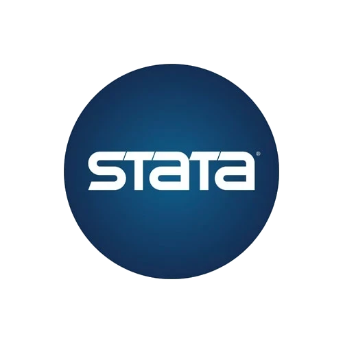

<!-- Profile README for github.com/evituu -->

<p align="center">
  
</p>

<p align="center">
  
</p>

<p align="center">
  I design and build <b>data-intensive systems</b>, <b>machine learning pipelines</b>, and <b>production-ready AI applications</b>.
</p>

---

## About me

I'm a software and data professional working at the intersection of **AI Engineering, Data Engineering, Machine Learning and System Architecture**.

My work is centered on turning data and models into reliable systems: from ingestion and storage to retrieval, inference, APIs, observability and production operations.

I also have a background in **Economics**, which strongly influences how I approach experimentation, causal reasoning, measurement and decision systems.

```text
Data  ->  Pipelines  ->  Retrieval / Features  ->  Models / LLMs  ->  APIs  ->  Products
                                  |                                      |
                                  +---------- Observability -------------+
```

## What I work with

<table>
  <tr>
    <td width="50%" valign="top">
      <h3>AI & ML Engineering</h3>
      <p>LLM applications, RAG, embeddings, vector search, computer vision, model evaluation and production ML systems.</p>
      <code>PyTorch</code> <code>scikit-learn</code> <code>Transformers</code> <code>LangChain</code> <code>RAG</code>
    </td>
    <td width="50%" valign="top">
      <h3>Data Engineering</h3>
      <p>Data modeling, ingestion pipelines, ETL/ELT, relational and vector databases, search and data-intensive architectures.</p>
      <code>PostgreSQL</code> <code>pgvector</code> <code>OpenSearch</code> <code>S3</code> <code>SQL</code>
    </td>
  </tr>
  <tr>
    <td width="50%" valign="top">
      <h3>Software Engineering</h3>
      <p>Backend services, APIs, full-stack applications and maintainable software architectures.</p>
      <code>FastAPI</code> <code>Python</code> <code>Node.js</code> <code>React</code> <code>Next.js</code>
    </td>
    <td width="50%" valign="top">
      <h3>Cloud & Reliability</h3>
      <p>Cloud infrastructure, containers, CI/CD, observability and reliability-oriented engineering.</p>
      <code>AWS</code> <code>Docker</code> <code>CI/CD</code>
    </td>
  </tr>
</table>

## Core stack

## Core stack

<p align="center">
  
  
  
  
  
  

  
  

  
  
  
  
  
  
  
  
  
  
  
  
  
  
  
  
</p>

**AI / ML**
`Python` · `PyTorch` · `TensorFlow` · `scikit-learn` · `Transformers` · `LangChain` · `RAG` · `Computer Vision` · `OpenCV`

**Data**
`PostgreSQL` · `SQL` · `pgvector` · `OpenSearch` · `S3` · `ETL/ELT` · `Data Modeling`

**Backend & Web**
`FastAPI` · `Node.js` · `React` · `Next.js` · `TypeScript` · `Tailwind CSS`

**Infrastructure**
`AWS` · `Docker` · `Vercel` · `GitHub Actions` · `Linux` · `CI/CD`

**Data Science & Econometrics**
`R` · `Pandas` · `NumPy` · `Statsmodels` · `Econometrics` · `Experimentation`

**Tools**
`Git` · `GitHub` · `VS Code` · `Obsidian`

---

## Selected projects

### Sistema de Geração de Texto

AI-assisted platform for structured project writing using **Retrieval-Augmented Generation**.

```text
Next.js -> FastAPI -> RAG Pipeline -> Embeddings -> Vector Search -> LLM
```

**Engineering focus:** semantic retrieval · project-level ranking · document ingestion · versioned generation · AI-assisted editing · LLM observability and governance

### Embedding Space Visualizer

Interactive environment for understanding **embedding spaces, similarity metrics and information retrieval**.

**Topics:** cosine similarity · Euclidean distance · dimensionality reduction · PCA · t-SNE · UMAP · retrieval ranking · high-dimensional vector spaces

### Computer Vision Experiments

Experiments involving **object detection, multi-object tracking and crowd analysis**.

**Topics:** YOLO · ByteTrack · pedestrian detection · tracking · crowd counting · video analytics

---

## Current research & engineering interests

- Foundation Models and AI Engineering
- Production RAG architectures
- Embeddings, vector search and retrieval systems
- Reliable Machine Learning and MLOps
- Computer Vision and video analytics
- Distributed and data-intensive systems
- Experimentation, causal inference and econometrics

---

## Engineering principles

```text
Reliability before unnecessary complexity.
Measure before optimizing.
Observability is part of the architecture.
Make trade-offs explicit.
Keep experimentation reproducible.
Separate prototypes from production systems.
Prefer empirical evidence over intuition.
```

---

## Languages

`Python` · `R` · `SQL` · `TypeScript` · `JavaScript`

## Contact & Socials

<p align="left"> <a href="mailto:vitoreduare@gmail.com">  &nbsp;&nbsp;Gmail </a> </p>

<p align="left"> <a href="https://www.linkedin.com/in/vitor-ferreira-cd/">  &nbsp;&nbsp;LinkedIn </a> </p>

<p align="left"> <a href="https://github.com/evituu">  &nbsp;&nbsp;GitHub </a> </p>

